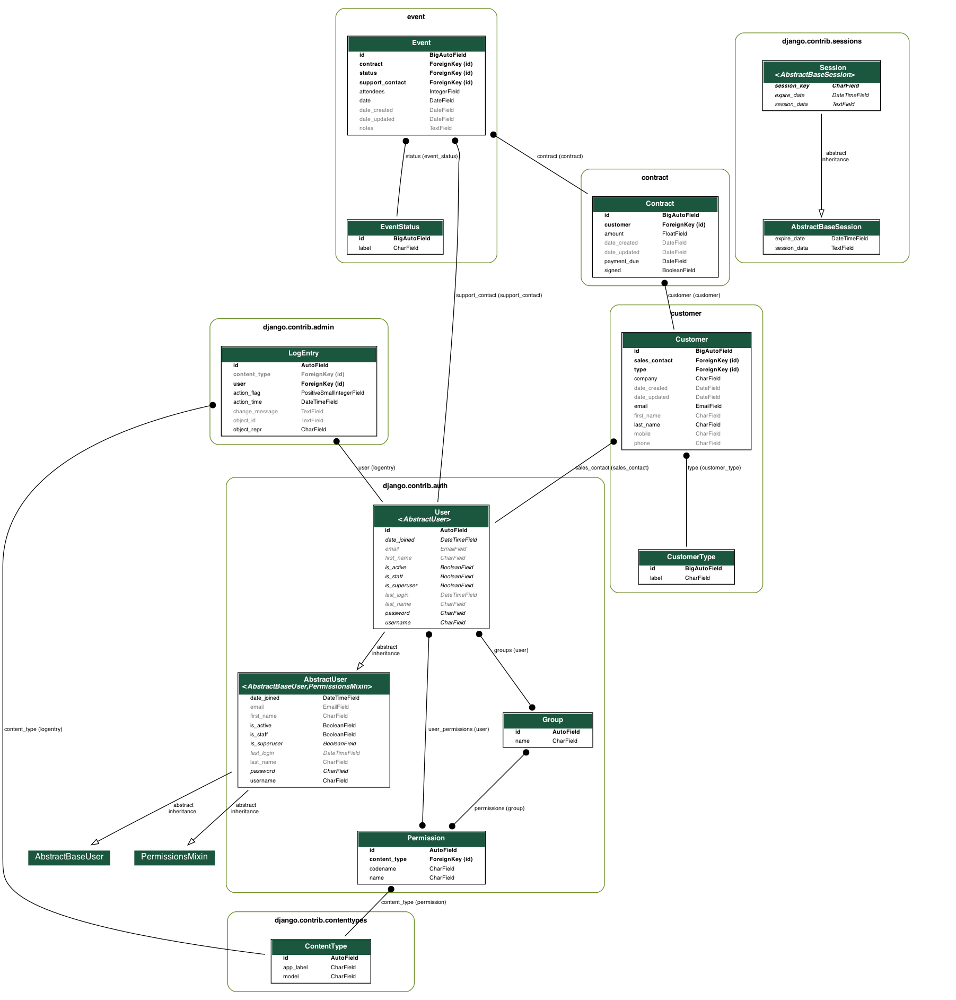

OC - Epic Events - CRM
=

<u>Openclassrooms - DA Python - Project 12 :</u><br>

CRM with access via API and Admin site.
<br>
Use of Django Rest Framework + PostgreSQL database.

## 1. <u> Documentation</u>

- Initial OC requirements available in the folder [doc](doc),
- Full API documentation available [here](https://documenter.getpostman.com/view/19799080/UyrEive3) (hosted by Postman),including permissions by endpoint,
- ERD diagram auto generated, using [django-extensions](https://django-extensions.readthedocs.io/en/latest/) + [Graphviz](http://www.graphviz.org/).




## 2. <u>List of endpoints</u> :

- POST: Login
- POST: Login Refresh
- POST: Create a customer
- PATCH: Update a customer
- GET: Search a customer
- POST: Create contract
- PATCH: Update a contract
- GET: Search contract
- POST: Create event
- PATCH: Update an event
- GET: Search event


## 3. <u> Set Up</u>

```bash
git clone https://github.com/XavierCoulon/OC-P12-Epic-Events-V2.git
cd P12_Epic_Events_V2
python3.9 -m venv .env
source .env/bin/activate
pip install -r requirements.txt
python manage.py runserver
```
PostgreSQL settings in settings.py:
````
DATABASES = {
    'default': {
        'ENGINE': 'django.db.backends.postgresql',
        'NAME': 'xxx',
        'USER': 'xxxxxxxx',
        'PASSWORD': '********',
        'HOST': 'localhost',
        'PORT': '5432'
    }
}
````
Start the server on your localhost and create a superuser:
````
python manage.py runserver
python manage.py createsuperuser
````
Admin available on http://127.0.0.1:8000/admin/
